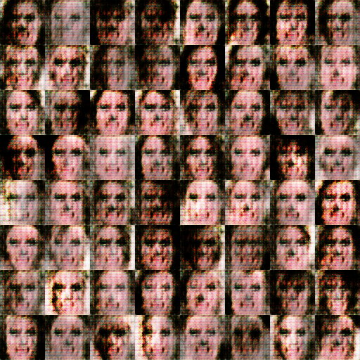
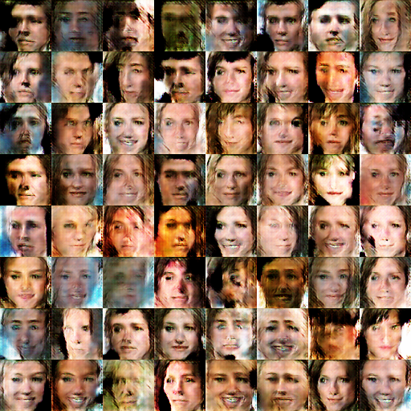
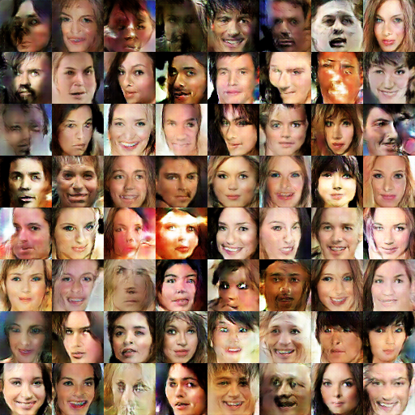
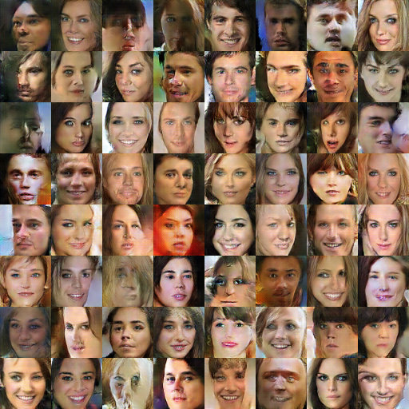

# DCGAN
Deep Convolutional Generative Adversarial Network, implemented with PyTorch

## Requirements

* python3
* numpy
* torch
* torchvision
* openCV
* matplotlib

## Introduction
 
 DCGAN, a generative adversarial network designed especially for images, is implemented in this repo, 
 instructions and tips listed in the references are followed, and several settings are experimented, 
 some observations can be found below. Here is guidance of this repo:

 * Main components are **main.py** & **model_manager**, almost all settings are defined in these two files.
 * Different model structures are under ```models/```, ones begin with **g_** are generators, and ones begin with **d_** are discriminators.
 * The training process are recorded and can be found under ```logs/```.
 * Generating images from different experiment can be found in ```generations/```, the folder name is same as corresponding log file.
 * Some helper functions are defined in **util.py** & **dataset.py**
 * In **experiment.sh**, all the experiments had been run are listed.

## Dataset

This project are a subset of **CelebA** dataset, whose images are resized to 64*64,
the data can be downloaded from [here](https://drive.google.com/open?id=1nByd2L5KokSI3BLO6y7BmeS3B6wJeFrF)
> The path in main.py should be changed to the dataset folder.

## Usage

To start the training, one can simply type :
```
python3 main.py train g_tutorial d_tutorial -id <id_name> -info <anything to be recorded in log file>
```
All the hyper parameters can be changed by pasing arguments, read **main.py** for more details.
The model used also can be changed by replacing g_*** and d_***

## Results
after 1 epoch:


after 3 epoch:


after 10 epoch:


after 17 epoch:


> The image quality seems that doesn't improve much after 10 epochs

## Observations

* The training process is very unstable, sometimes things would succeed for crash even in same settings,
  so detect the failure as soon as possible, and start over again. 
* The loss of Generator/Discriminator(real,fake) wouldn't decay, but when any of them goes to 0, it's probably 
  wrong somewhere. Stop early.
* The effect of initialization for model weights is slight.
* If **Adam** is used for optimizer, the trianing process is very sensitive to **beta_1**(default = 0.9). If the value isn't
  smaller(in tutorial = 0.5), the process would be very unstable. It would work even when it's 0.
* The learning rate might be important
* In Discriminator structure, there's only small difference between using **Leaky ReLU** or **ReLU**
* **Batch Normalization** is super important for stability.
* The order of training real/fake images for Discriminator doesn't matter.
* In Generator, using bigger kernel size and smaller stride size(overlap with each other) leads to better image quality.
* In Discriminator, using strided-kernel instead of max-pooling for down-sampling leads to better performance.

## References

* [DCGAN Pytorch tutorial](https://pytorch.org/tutorials/beginner/dcgan_faces_tutorial.html)
* [GAN hacks](https://github.com/soumith/ganhacks)

